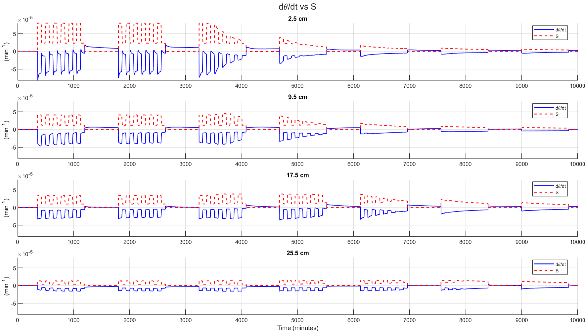

Jan: dθ/dt  is negative even there is no uptake, but this is the distribution I think
Mathieu : a good fit/good regression in the first 3 days prove that the model is working, it could be that there is an exageration but it works (Jan: this (the overestimation) can be related to the hydraulic properties that are used)
Mathieu : I believe that the SWaP assumption is working and collapsing in certain conditions
Depending on : Tact, soil type, initial conditions 

Dagmar : redistribution (rswf) exists but too slow comparing to the uptake (slow over several  hours) 
Mathieu : we retrieve SUF Despite Dagmar's assumption is wrong (we proved a goodfit), my understanding is that the assumption is wrong but not that wrong and somehow it's obvious, when we have wet soil the conductivity is high enough to compensate but doesnt compensate totally the uptake, if it does then the water content would not change what is taken is directly replaced. That's not what we see, there is a bit of compensation via the soil rswf but still the pattern (fingerprint of the uptake) still visible SUf is still visible.
Jan : redistribution always exist but the question is how big comparing to the uptake 
Mathieu : I suggest you use diffferent soil (check the initial conditions, parameters that I put)
Mathieu : Us appears not only when soil is restricted (dry) we can have compensation even with wet soil 
1. Phase 1: Us when conductivity is high then there is compensation, a lot of Us occurs 
2. Phase : Soil become very limiting and compensation can't compensate and then the funny thing Dagmars merthod work again (day 7), Up represent the relSink (we go from Up to relSink, from day 1 to day7)
Mathieu :In the middle period : Us is making things non linear between dthetadt and Tact starting from day 3 cycle 3
Jan: at day 3 when you turn the light on at the start of the light turned on the water potential near the soil still relatively large so we still have a large flow toward the roots butt since the soil already quiet with decreasing WC in the soil  dry you will have a rapid decrease in soil water potential and therefore a decrease in RWU and thats making your slope of the curve (Up vs Tact) decreasing, to bend off

Next step :Simulate different soil
2. Verify the hypothesis : what is happening in term of Us, look to simulation data (the deviation (C3) between Up and relSink, caused by the change hetergoniety of gradient which is causing a fast change of Us caused by Tact ==> this should be verififed or proved with data, you can immediately look to simulatinon data to prove if it's really the case (Jan)
